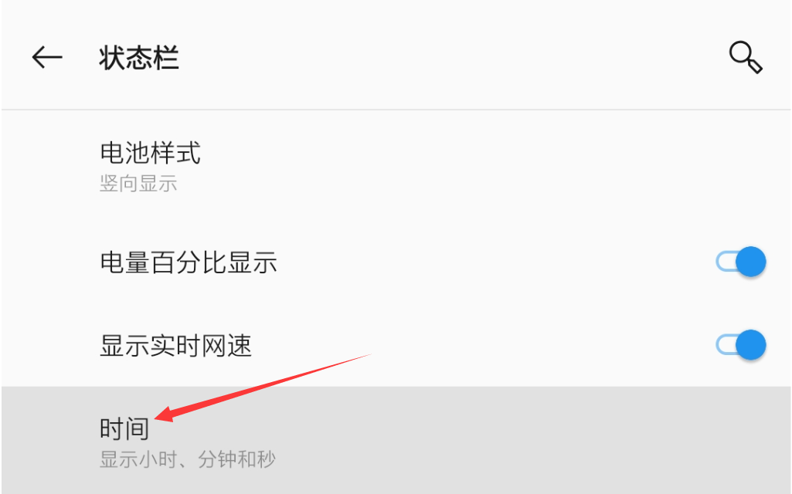
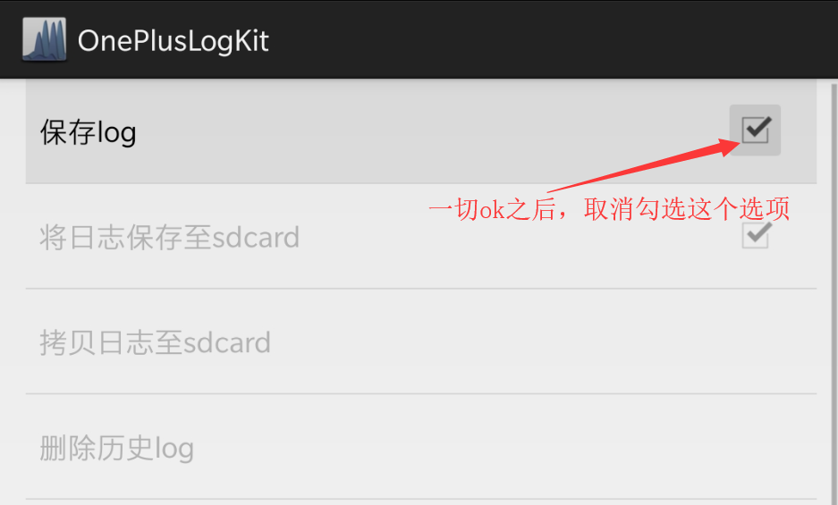
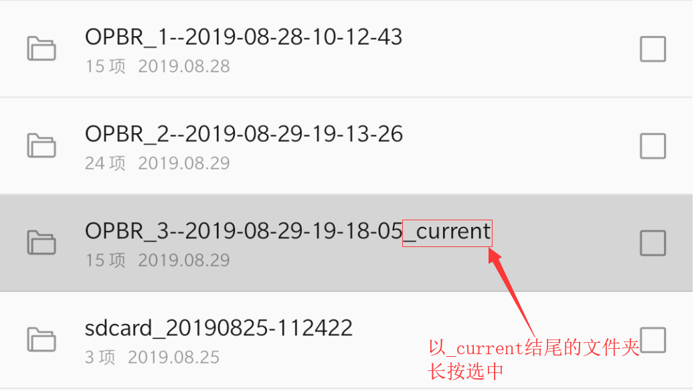

### 日志抓取教程：

1. 开启时间秒数显示

- 1) 进入【设置--显示--状态栏】

- 2) 点击【时间】

- 3) 选择【显示小时、分钟和秒】

2. 打开工程模式日志界面

- 方法一（推荐）：

- 1) 下载OnePlus LogKit（下载地址：[GitHub](https://github.com/MlgmXyysd/OnePlus-Report/releases/download/1.0/OnePlus.LogKit_1.0.apk) [百度网盘](https://pan.baidu.com/s/11WAgYYlEn5AfIstSmoCUDw) [酷安](https://coolapk.com/apk/org.meowcat.oneplus.logkit)）[作者：MlgmXyysd，非一加官方应用]

- 2) 安装后直接打开

- 方法二：

- 1) 在手机拨号中输入【*#800#】

- 2) 如出现提示请点击【进入】

- 3) 选择oneplus logkit

3. 打开保存日志选项

- 1) 选中【将日志保存至sdcard】

- 2) 选中【保存log】

- 3) 如出现提示请点击【取消】

4. 问题复现（比如：王者卡死）

- 过程中截图或录屏（重要！记录时间点，便于分析）

5. 抓取bugreport信息

- 1) 回到【工程模式日志】界面（参考步骤2）

- 2) 点击【其他log日志】

- 3) 点击【抓取bugreport信息】（这一步时间较长请耐心等待，等手机振动/有Toast提示/按钮亮起后可进行下一步操作）

- 4) 取消选中【保存log】

6. 打包分享日志

- 方法一：

- 1) 点击【打包日志并分享】

- 2) 点击【分享】（这一步时间较长请耐心等待）

- 3) 等弹出分享对话框时，通过【[Bug反馈规则](Bug-report.md)】里的方法将日志发送给我

- 方法二：

- 1) 文件管理打开sd卡根目录下的【oem_log】文件夹

- 2) 找到【_current】后缀的文件夹，长按选中

- 3) 点击右上角【更多选项】（右上角三个点）

- 4) 点击【压缩】

- 5) 将压缩后的文件通过【[Bug反馈规则](Bug-report.md)】里的方法发送给我（文件名和文件夹的名字一样，后缀为zip）
